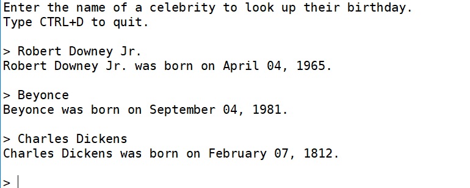

# Wiki-birthday 0.2

A script that looks up the Wikipedia page of a famous person 
and returns their birthday...

Include a descriptor in parentheses to find celebrities with common 
or ambiguous names, e.g.: 

_Michael Johnson (athlete)_

_Prince (singer)_

Famous people without exact known birthdays aren't searchable.

The program uses Python libraries `requests` and `Beautiful Soup 4 (bs4)` 
to retrieve the web pages and parse them, respectively. 
